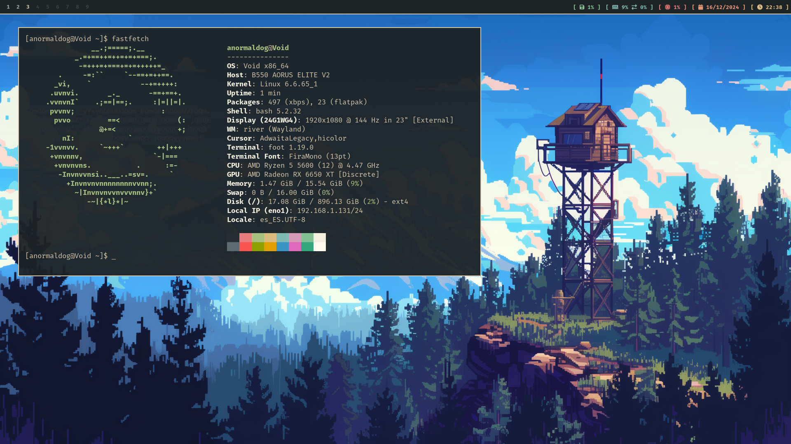

# RiverDotfiles 
## River dotfiles for Void Linux 

Mostly based in [EverForest](https://github.com/sainnhe/everforest) color-scheme 
But for GTK was used [Nordic](https://github.com/EliverLara/Nordic) color-scheme 
---

---

| Software | Used |
| -------- | ---- |
| Distribution | [VoidLinux](https://voidlinux.org/) |
| StatusBar | [WayBar](https://github.com/Alexays/Waybar) |
| Compositor | [River](https://codeberg.org/river/river) |
| Terminal | [foot](https://codeberg.org/dnkl/foot) |
| WebBrowser | [firefox](https://www.mozilla.org/en-US/) |
| Screenshots | [Grim](https://sr.ht/~emersion/grim/) |
| Launcher | [fuzzel](https://codeberg.org/dnkl/fuzzel) |
| Backgrounds | [SwayBG](https://github.com/swaywm/swaybg) |
| OutputConfig | [wlr-randr](https://sr.ht/~emersion/wlr-randr/) |
| IconTheme | [Papirus](https://github.com/PapirusDevelopmentTeam/papirus-icon-theme) |
| GTKTheme | [NordicGTK](https://github.com/EliverLara/Nordic) |
| ImageViewer | [imv](https://sr.ht/~exec64/imv/) |
| VideoViewer | [Celluloid](https://celluloid-player.github.io/) |
